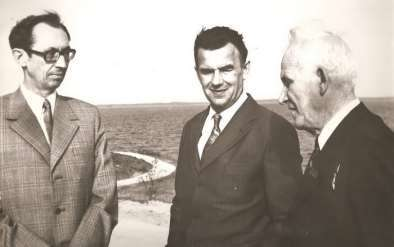
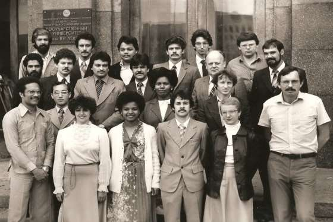
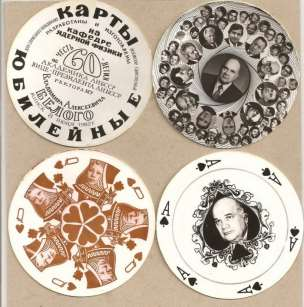
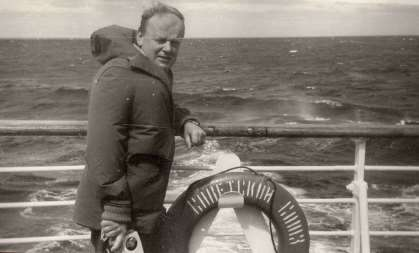
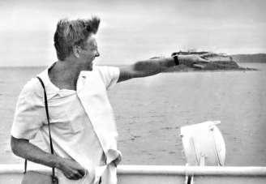
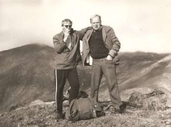

1. [~~Про мой род, себя и нашу элиту~~](./1.md)
2. [~~Бацькаўшчына~~](./2.md)
3. [~~Академия — завод — университет~~](./3.md)
4. [**МРТИ — хорошо, БГУ — лучше**](./4.md)
5. [Чернобыль](./5.md)
6. [В Москву, к властям](./6.md)
7. [Дорога к Вискулям](./7.md)
8. [Народы малочисленные и к ним приравненные](./8.md)
9. [Если б знал я, с кем еду, с кем водку пью…](./9.md)
10. [Беловежская пуща, Вискули, 7—8 декабря 1991 года](./10.md)
11. [Беларусь — Соединённые Штаты](./11.md)
12. [Интеллигенция и политика](./12.md)
13. [О университетах и ВУЗах, степенях и лекциях](./13.md)
14. [О «моём» зарубежье](./14.md)
15. [Патология](./15.md)
16. [Через годы, через расстояния](./16.md)

---

# Новое назначение
В самом начале 1966 года ректор БГУ академик А. Н. Севченко сказал мне.
— Тебя завтра позовут в горком партии и чтобы ты там «не вздумал брыкаться». Я этот ход придумал и провёл большую подготовительную работу. Тебе предложат очень ответственную
должность, и ты мгновенно получишь квартиру. — Какую должность?
— Проректора по науке Минского радиотехнического института (МРТИ).
Честно говоря, я пошёл бы ради квартиры и на менее престижную должность, так как жить со всеми удобствами во дворе, бегать по утрам к водоразборной колонке и жарко топить печку, чтобы не простудить полуторалетнюю дочку, мне осточертело. Но для приличия я хотя и чуть-чуть, но поершился.
— Антон Никифорович, а как же с докторской? По мнению моего заведующего кафедрой я близок к её завершению.
— Ну и завершай на новом месте. Кто тебе мешает? Проректору выходить на защиту проще, чем старшему научному или доценту. Да и я тебя не собираюсь забывать, помогу.
На следующий день в горкоме КПСС было сказано, что мне оказывается большое доверие и меня направляют проректором по науке в престижнейший вуз — МРТИ. Разговор вёл секретарь горкома Василий Иванович Шарапов. Он произвёл на меня весьма благоприятное впечатление. Дал, понять, что в МРТИ очень опытный ректор, что он добился приглашения в институт многих специалистов со всего СССР, но пора серьёзно заняться укреплением института местными кадрами. Потом вызвал секретаря, попросил соединить его с ректором — Иваном Сидоровичем Ковалёвым, не спешил поднимать телефонную трубку, когда секретарь сообщила, что ректор на связи. Выдержав паузу, душевно приветствовал по телефону ректора.
— Итак, как мы договаривались, сейчас к вам подъедет Шушкевич.
Через два дня я приступил к новой работе.
Бюджетное финансирование МРТИ по статье научные исследования было весьма скромным, хотя в пересчёте на 1000 студентов более весомым, чем в других вузах. Горком и ректор были единого мнения: нужно как можно интенсивнее развивать прикладные исследования по договорам с предприятиями радиотехнического профиля БССР. Я тоже был сторонником такого подхода с одним маленьким уточнением: развивать работы по хозяйственным договорам с организациями, разрабатывающими и производящими новое и *располагающими большими деньгами*. А они были в основном за пределами Беларуси.
На день моего прихода фонд заработной платы всего МРТИ по хоздоговорной тематике составлял третью часть фонда зарплаты одной только кафедры ядерной физики БГУ. Расширение связей с предприятиями республики, увы, не сулило серьёзных финансовых вливаний, поэтому я отправился в вояж к тем, у кого много денег: в Москву, Подмосковье, Ленинград. Подталкивал на такого рода
контакты сотрудников МРТИ, но очень скоро они меня стали подталкивать, так как дополнительный заработок — лучший стимул повышения деловой активности. Ректор относился ко мне подчёркнуто хорошо, но старался нагрузить меня всякой трудоёмкой работой, в том числе и далёкой от проректорской. В отдельных случаях я не мог с ним не согласиться, так как это означало бы, что я такую работу не способен делать.
— Знаете, Станислав Станиславович, вы сделаете доброе дело, если прочтёте для студентов четвёртого курса «Квантовую электронику». У нас пока некому её читать, а она в числе обязательных курсов по программе Минвуза. Вы ведь стажировались у самого Прохорова — отца советской квантовой электроники.
Потом примерно таким же образом мне был навязан курс «физика вакуума», хотя ни у какого отца вакуумной техники я не стажировался, а только работал с вакуумными установками, как и любой физик-экспериментатор. Я оказался в скованном положении в отношении поездок — лекции нельзя было переносить или отменять. Чтение новых для меня курсов требовало немалого времени на подготовку, но ректор, по-видимому, считал, что у меня его избыток.
— Станислав Станиславович, позвольте дать вам совет. Отчёт института по науке должны писать вы лично. Я говорю это вам, потому что был в вашей шкуре — работал проректором по науке.
Меня, как говорят, заело. И я решил расставить точки над «і» и ответить так, чтобы не получать банальных поучительных советов.
— Уважаемый Иван Сидорович. Позвольте мне решать, кому что делать в подчинённой мне Научно-исследовательской части (НИЧ). Я подписываю отчёт и за него отвечаю, а, как и кем он пишется, вряд ли имеет принципиальное значение. Кроме того, главная моя задача, о которой вы говорите на всех ректоратах и собраниях, решительное увеличение объёма хоздоговорных работ. Я не так давно здесь работаю, а этот самый объём вырос почти на порядок. Знаю, у вас есть любимчики в НИЧе. Они, действительно, стонут от обилия отчётности. Я им сочувствую, но такую отчётность придумал не я, а министерство, и мы с вами не в состоянии что-то изменить.

# От беспартийности к партийной интриге
После такого разговора ректор не давал мне попечительских советов, а отчёт института, как и прежде, вряд ли читал. Однако мне — беспартийному — стали поступать выписки из решений партбюро института с рекомендациями усилить, улучшить, принять к сведению, в такой-то срок информировать партбюро... А на заседания партбюро меня почему-то не приглашали. При какой-то случайной встрече я пожаловался на это секретарю горкома партии В. И. Шарапову. Назавтра бледный, как незасвеченная киноплёнка, секретарь бюро прибежал ко мне сообщить, что благодаря его и ректора усилиям райком выделил место для приёма меня в партию. Я должен немедленно взять три рекомендации в университете, так как в МРТИ я работаю менее года и здешние рекомендации для приёма меня кандидатом в члены КПСС не годятся. Так в начале 1967 года я вступил в кандидаты, а в 1968 в члены КПСС.
Я хорошо понимал, что ректор видит во мне претендента на его ректорскую должность . Хотя абсолютно честно, положа руку на сердце, я мог сказать, что и не помышляю об этом, ректор бы мне не поверил. Его, буквально, бесило то, что я не выражал никакого восторга по поводу его личной научной деятельности. А этого в принципе не могло быть, так как я понимал, чем он занимается. Он выгодно отличался от корифеев МРТИ тем, что знал азы электродинамики и хорошо читал курс классической электродинамики для студентов. Все без исключения его за это хвалили. А вот его научная работа напоминала решение на практических занятиях задач, специально придуманных, для хорошего усвоения студентами лекционного курса. Но в том, что мы называем сейчас пиаром, он был непревзойдённым мастером жанра. Я никогда не намекнул и не сказал ни ему, ни кому-то из сотрудников МРТИ об этом, но, как человек умный и опытный, ректор не просто догадывался, он знал моё о нём как об учёном мнение.
Материал на докторскую диссертацию, с которым я пришёл в МРТИ начинал гнить, а у меня не было времени заняться докторской. Погубить задел означало отбросить себя в научном плане ещё на несколько лет назад. Толчком моей решительности послужило
институтское партийное собрание, на котором избрали новое партбюро и нового секретаря бюро — заведующего кафедрой технической механики доцента Александра Альбертовича Шимковича. На следующий день после собрания я с ним разоткровенничался, выслушал его мнение по моим делам, после чего зашёл к ректору и попросил меня не перебивать.
— Уважаемый Иван Сидорович. Ваше любимое изречение «два медведя в одной берлоге не уживаются», которое вы при каждом удобном и неудобном случае мне напоминаете, обязывает меня задуматься над своей судьбой. Вы решительно противодействуете тому, чтобы я написал докторскую диссертацию, так как видите во мне этого второго медведя. Бессмысленно заверять, что я не буду вашим конкурентом и что я буду себя хорошо вести. Поэтому я предлагаю вам сделку. Вы даёте мне творческий отпуск на написание докторской. Все необходимые письма и документы по этому поводу я подготовлю сегодня до конца дня. А я увольняюсь сразу же после отправки диссертации в совет по защите. Подать вам сегодня заявление о желании уволиться по собственному желанию, датированное днём окончания творческого отпуска, я не могу. Вы очень опытный человек и очень легко обыграете ситуацию таким образом, что я окажусь в крайне неприглядной роли. Поэтому я сегодня при вас готов подать такое заявление человеку, которому доверяете вы и я. Он его сохранит до согласованной даты.
Я не исключал, что Иван Сидорович выразит какие-нибудь сомнения, не согласится на мой вариант. Готов был даже сказать, что тогда мне придётся быть более откровенным во всех тех местах, где я высказываюсь и о нём, и о институте предельно положительно. Но ничего не понадобилось. Он даже похвалил меня.
— Я временами подумывал, что у вас не хватает решительности.
Однако ошибся. А кому же из тех, кому я доверяю, доверяете и вы? Не Тимофею ли Ерофеевичу, проректору по учебной работе?
Это было чистым подстрекательством, потому что я не сомневался, что не любит ректор проректора Солодкова и знает, что у меня с ним прекрасные отношения.
— Тимофею Ерофеевичу я, конечно же, доверяю, но не напрягать же его хранить тайну почти полгода. Для преподавателя общественных наук это трудная задача. У меня есть иное предложение.
— Кто?
— Вновь избранный секретарь партбюро.
— А он согласен?
И здесь, в полном соответствии с тем, как мы условились с новым шефом партбюро Александром Шимковичем, я приврал.
— Давайте позовём его и спросим...
Когда мы втроём — Иван Сидорович, Александр Альбертович и я в демонстративно прекрасном настроении выходили из кабинета ректора, вряд ли кто-то мог подумать, что мы сплели непростую интригу. В результате я получил творческий отпуск и не малый — шесть месяцев. Написал и успешно защитил 13 мая 1970 года в Москве во Всесоюзном научно-исследовательском институте оптико-физических измерений докторскую диссертацию. После защиты написал новое заявление с просьбой об увольнении, так как уложился в срок более короткий, чем предоставленный мне отпуск. Вернулся в родной Белорусский государственный университет на «свою» кафедру, по которой через год был утверждён в звании профессора.
После моего ухода «медведь» Ковалёв властвовал в своей «берлоге» всего семь месяцев. В газете на полный разворот появилась огромная статья «Ректор», в которой доказательно описывались многие его деяния, трудно совместимые с занимаемой должностью. Его «подсидели» те, в чьей преданности по отношению к себе он был абсолютно уверен. Я же счастлив, что не сделал ничего, способствующего его отставке.
Хождение в радиотехнический мне многое дало. Я понял, к примеру, сколь велик и прекрасен во всех отношениях по сравнению с МРТИ мой родной БГУ. Однако и на Солнце есть пятна, в чём вскоре пришлось убедиться.

# Опять в альма-матер
Упрямая вещь эти крылатые фразы. Действительно, нельзя войти в одну и ту же воду дважды, нельзя вернуться в тот же университет, который ты покинул три года назад. Возвращение не породило для меня в БГУ никаких сложностей. Не возникли трудности ни с чтением лекций, ни с подключением к выполнению новых хоздоговорных работ, ни с коллективом кафедры, ни с деканатом, ни с ректоратом.
Однако… 
Становилось всё более понятным, что мой заведующий кафедрой, теперь уже доктор наук, профессор, впал в немилость. Этого следовало ожидать, так как начальство обычно не любит ретивых и свободомыслящих. Но немилость немилостью, а дело делом. Учебный процесс на кафедре — на зависть остальным, студентов просится на специализацию гораздо боль ше, ч ем выделяется кафедре мест, всё нормально с наукой, хоздоговорами, с публикациями, с защитой диссертаций, наконец, даже с политико-воспитательной работой.
Едва я освоился на старом, но всё-таки новом месте, зовёт меня к себе дед. Так теперь уже все называли ректора Севченко, чему он не противился и даже временами радовался, считая эту кличку местным эквивалентом аксакала. Спрашивает меня, для формы, конечно, про житьё-бытьё. Упрекает за то, что не сразился я открыто с ректором МРТИ Ковалёвым. И это для формы. Жду, когда к делу перейдёт. Наконец, начинает.
— Разговор между нами. Плохого, как ты знаешь, я тебе никогда не советовал. И сейчас тоже не посоветую. Так вот, объявим мы скоро конкурс на должность заведующего кафедрой ядерной физики.
Подавай документы. Тебя обязательно изберут.
— Антон Никифорович, вы ведь в курсе дел, что я хорошо знаю правила избрания и переизбрания по конкурсу в вузах. Кафедрой сегодня заведует профессор Писаревский, кафедра приличная по всем показателям, поэтому сначала на Совете должен быть рассмотрен вопрос о переизбрании. Мне почему-то кажется, что
Писаревского переизберут.
— Пусть тебе это перестанет казаться. Ректорат вправе объявить конкурс на избрание. Тайное голосование по переизбранию бывает в исключительных случаях. Открытый конкурс лучше, демократичнее. Пусть и Писаревский подаёт на конкурс. Совет тайным голосованием решит, засиделся он в заведующих или нет. Раз я тебе говорю, подавай заявление, значит он засиделся, и совет изберёт тебя.
— Уважаемый Антон Никифорович, простите, я долбёж кой, вышибающей Писаревского, не буду. Я бываю у него дома, он не только профессор, но и мужик нормальный, водку с ним пью по праздникам. На предательство не пойду.
— Причём здесь предательство? Открытый честный конкурс! Горько пожалеешь, если не подашь. Вспомнишь меня, но будет поздно.
Вскоре был объявлен конкурс, дед ещё раз посоветовал мне подать заявление. Я ещё раз отказался. 
Антон Никифорович нашёл человека, который подал на конкурс на должность заведующего кафедрой ядерной физики и мирного использования атомной энергии, и обеспечил его избрание. Человек этот был неплохим физиком, положительно характеризовался, имел весьма влиятельного папу республиканской значимости и возглавлял в Академии наук микроскопическую лабораторию ядерной физики. Думаю, что он и понятия не имел во что ввязывается. По сравнению с
его академической лабораторией кафедра была многофункциональным монстром, продолжающим развиваться. Да и служивые на ней были не лыком шиты.
С первых дней работы с новым заведующим преподаватели кафедры поняли, что он понятия не имеет об организации учебного процесса, да и лекции его не могли служить примером ни педагогического, ни смыслового совершенства. По моему мнению, новый зав предполагал, что коллектив кафедры воспримет его — сотрудника академического института — так, как преподаватели других кафедр принимали именитых академиков, давших согласие возглавить кафедры на физфаке университета. На физическом факультете восторженно приветствовали тех, кого можно было называть корифеями науки, — академиков Михаила Александровича Ельяшевича, Алексея Васильевича Лыкова, Николая Николаевича Сироту, Рема Ивановича Солоухина, Бориса Ивановича Степанова, Фёдора Ивановича Фёдорова. Во всех этих случаях сотрудники кафедр с большим энтузиазмом брали на себя бюрократические, организационные и прочие ненаучные дела, зная, что высокая научная квалификация заведующего поможет им с лихвой покрыть всё вложенное ими в дело становления и развития кафедры.
С кафедрой ядерной физики дела обстояли иначе. Никто по своей инициативе не брался делать то, что обязан был по долгу службы делать заведующий. А что касается науки, то на кафедре работали тогда преподаватели и сотрудники, у которых он сам мог бы многому поучиться. Правда, родители у них были неименитые. Когда же на четвёртом месяце правления новенького всем стало ясно, что некогда образцовая структура начинает разваливаться, заведующий ушёл от греха подальше — уволился. Ректор сразу же приказом назначил меня исполняющим обязанности заведующего кафедрой, а через два месяца я был избран на эту должность по конкурсу и переизбирался на неё до 1991 года.

—-
До сих пор я не могу дать вразумительный ответ на вопрос, почему ректор университета академик Антон Никифорович Севченко изгнал из университета, а тем самым и из Беларуси профессора Александра Николаевича Писаревского? Кстати, вместе с Писаревским уехала и его жена — Галина Ахатовна Шагисултанова — доктор химических наук, профессор, замечательный педагог и учёный. В Ленинграде, куда они возвратились, их приняли с распростёртыми объятиями. Престижность НИИ и вузов, которые предложили им работу, не вызывает сомнения. Должности, на которые их там избрали по конкурсу, — тоже.
С позиций сегодняшнего дня хорошо понимаю, что вопрос нужно было согласовать с партийными боссами и получить разрешение на изгнание специалиста, которого десять лет тому пригласили сюда наладить дело. Дело налажено и налажено весьма прилично. Есть кафедра, которая обеспечивает чтение общего для всех студентов-физиков курса «ядерная физика» и лабораторный практикум по этому курсу. Специализация студентов осуществляется по трём специальностям: ядерная физика, ядерная электроника и ядерные энергетические установки. Продолжается бурный рост кафедры. От неё отделилась и стала самостоятель ной кафедра биофизики, выделились лаборатории и отделы, образовавшие НИИПФП — Научно-исследовательский институт прикладных физических проблем.
Если искренне желаешь развития университета, науки, образования, то руководствуясь какими соображениями можно выгнать специалиста, затеявшего доброе дело и продолжающего успешно его развивать ? Или же это решение более высокого начальства?
Зарвался, мол, не прислушивается к мнению руководства? Убедительного ответа на мои вопросы я не знаю. Многие отвечают — за то, что Писаревский — еврей. А. Н. Севченко не был явным антисемитом, но болезнь эта не могла его не коснуться, так как он постоянно вращался в самых высоких партийных кругах. Если речь шла о приёме еврея на работу, дед мог спросить «не слишком ли у вас их много?», но я не знаю случая, когда кто-то из руководителей подразделений действительно желавших принять на работу в своё подразделение еврея, получили бы категорическое дедово «нет!». Более вероятным я считаю давление на Севченко со стороны Академии наук. Злачное место президента в ней с 1969 по 1987 год занимал Николай Александрович Борисевич — учёный-физик, но более всего опытнейший коммунистический менеджер, сумевший подчинить себе в Академии всё и всех. Наш университетский ректор, стремившийся к такому же принципу правления, не мог стать университетским «мафиози». При всех прегрешениях его не покинули человечность, порядочность, совестливость и чувство справедливости. Борисевич же не усложнял свою жизнь такими качествами.
За академические звания в советское время неплохо платили. Н. А. Борисевич сумел взять в свои руки управление избранием в академики и члены-корреспонденты и полностью контролировать этот процесс, причём научные достижения претендующих на избрание стали при нём учитываться в пренебрежительно меньшей мере, чем личная преданность президенту Академии. Естественно, для общественности всё подавалось в абсолютно ином благопристойнейшем свете.
В свою команду Борисевич вовлёк нескольких моих однокурсников. Двое из них мне откровенно признались, что как ни печально, но они вынуждены поступать не по убеждениям. Если на выборах членов-корреспондентов при тайном голосовании кто-то из них будет голосовать за меня, то это станет доподлинно известно президенту Академии наук Борисевичу, и голосовавшему не поздоровится. А что ещё важнее — положение его сотрудников, будет ужасным. Предписания мафиози (так называли Борисевича в университете), как правило, выполнялись молча. Но молчание и
напряжение временами дорого стоят. Двое только что упомянутых моих однокурсников рано ушли из жизни. Не исключаю, что нахождение в команде мафиози и вынужденные действия не по совести этот уход ускорили. Не вынес несправедливости и, бесспорно, очень талантливый и очень многого достигший физик, член-корреспондент Валентин Дмитриевич Ткачёв, семь лет возглавлявший Белорусский политехнический институт. Сознавая, что Борисевич не допустит его избрания академиком, он 16 февраля 1985 года застрелился.
Что касается меня лично, то я был избран членом-корреспондентом Академии наук БССР после отставки Борисевича, когда президентом академии стал математик с мировым именем Владимир Петрович Платонов. Тем не менее, когда я стал Председателем Верховного Совета — высшим должностным лицом независимой Беларуси — академик Николай Александрович Борисевич позвонил и попросил его принять. Если бы кто-нибудь был свидетелем нашей беседы, то он бы счёл, что большего друга, искренне меня поддерживающего, у меня не было и не могло быть. К слову, он прекрасно понимал все сложности переходного периода с наукой и учёными. Многое, сказанное тогда им по этому поводу, повлияло и на мои последующие действия. Я искренне поблагодарил его за чрезвычайно полезную информацию. А в самом конце встречи.
— Станислав Станиславович, вам надо баллотировать ся на следующих выборах в академики. О вас, как об учёном, очень высокого мнения академики отделения физики и информатики.
— Уважаемый Николай Александрович. Я очень благодарен вам за добрые слова в мой адрес. Но мой поезд ушёл. Я не могу сейчас посвятить физике ни минуты. Служебные обязанности отнимают у меня всё время, а они с физикой не связаны.
Очень хотелось мне упрекнуть академика в той несправедливости, которую в бытность президентом насаж дал Николай Александрович, но это было бы местью, а мстительность — качество отвратительное. И мать, и отец учили меня не опускаться до уровня мстящего.

# Помня рекомендации Резерфорда
Говорят, что Эрнест Резерфорд, один из величайших физиков мира, все научные работы которого посвящены вопросам атомного ядра, будучи назначенным руководителем Кавендишской лаборатории Кембриджского университета в Англии, сказал, что никогда не надо пытаться восстанавливать былое величие. Скорее всего, его слова — дань уважения тем, кто занимал пост руководителя этой лаборатории ранее и прославил её своими научными достижениями. Имена предшественников Резерфорда известны физикам всего мира: Дж. К. Максвелл, Дж. У. Рэлей, Дж. Дж. Томсон. Имеет право на жизнь и другое понимание слов Резерфорда. Если вы берётесь за дело, которое пришло в упадок или ослабло, не нужно воскрешать все его старые составляющие.
Деяния великих физиков — пример для подражания. Однако нельзя обезьянничать. На первом заседании кафедры после моего избрания на Совете университета решили не возрождать былое величие, оно в масштабах нашего университета и так не совсем потеряно. Но чтобы успешно развиваться, нужно выработать критерии, позволяющие самим оценивать свои успехи. В плане учебной работы постановили руководствоваться оправдавшим себя единственным из арсенала старых подходом — чем больше студентов хотят специализироваться на кафедре, тем лучше. Из записавшихся на наши специализации студентов мы можем открыто отобрать лучших на выделенные нам плановые места.
С наукой сложнее. Бюджетное финансирование по науке никчемное. В его рамках можно в лучшем случае пытаться разбираться в чужих журнальных научных публикациях и проводить научные семинары, доказывающие, что мы способны в некоторых из этих публикаций разобраться. Это необходимо, важно, но этого явно недостаточно, чтобы считать кафедру университетской. Надо интенсивнее искать благодатную договорную тематику и богатых заказчиков, желательно, по профилю кафедры. Не получится — хотя бы близких к её профилю.
В моём детстве мать только одной ей известным способом внедрила навечно в мою память изречения любимых ею поэтов, писателей, публицистов, критиков. Я вспоминаю их и сегодня в очень подходящее для осмысления сложившейся ситуации время. Обычно она несколькими штрихами поясняла, что за человек это написал, и приводила снова же надолго врезающиеся в память фрагменты его биографии. Мать очень любила русского критика и публициста Дмитрия Ивановича Писарева, утонувшего в 28 лет. Почти четыре года своей короткой жизни он провёл в одиночной камере Петропавловской крепости, где написал свои лучшие статьи, в одной из которых были слова: «Когда труд — удовольствие, жизнь — радость».
По большому счёту следующие 14 лет моей работы на должности заведующего кафедрой ядерной физики и мирного использования атомной энергии в Белорусском государственном университете были годами относитель но безоблачными и точно соответствовали упомянутым словам Писарева. Я старался, чтобы это время было таким же для сотрудников, аспирантов и студентов. Встряски, безусловно, случались, но они не вели к потрясениям. В 1986-м году многое изменила Чернобыльская катастрофа, но это — особая тема, и о ней позднее.
В 1972 году ректором университета стал доктор философских наук Всеволод Михайлович Сикорский. Как и большинство физиков, я не жаловал преподавателей истории КПСС, но профессор Сикорский был исключением. В моей памяти он остаётся честнейшим и достойнейшим интеллигентом, противником всяких интриг и закулисных действий с единственным серьёзным недостатком — слабым здоровьем. Сказывалось длительное время его пребывания в партизанском отряде, многократные переохлаждения, голодания. Тяжело ему было тянуть лямку ректора, но он тянул её добросовестно. Для меня он остаётся лучшим ректором моих малооблачных университетских лет.
Особый характер носила работа с иностранными студентами. В большинстве случаев она доставляла радость преподавателям и учебно-вспомогательному персоналу. Приятно было видеть, как вчерашние «несмышлёныши» и в языке и в физике «грызут науку», приходят в лаборатории к преподавателям и сотрудникам с вопросами от утра до поздней ночи. На студентов из Чехословакии, ГДР, Кубы было бы грешно жаловаться. Они ничем не отличались от лучших советских студентов, привлекались к исследовательской работе, отдельные из них уезжали соавторами научных публикаций совместно с сотрудниками и аспирантами кафедры.

Трудолюбие вьетнамцев было поучительным для всех, и, как правило, они имели хорошую успеваемость . Редкое исключение являли вьетнамцы, направленные на учёбу в Советский Союз за военные заслуги. Они просто не имели тех пороговых знаний, без которых университетские курсы не могут быть поняты. Мы, как могли, выкладывались, чтобы они имели знания на крепкую тройку и меньше четвёрки за такое достижение не ставили.
Кубинцы, специализировавшиеся на кафедре, установили университетский рекорд, я уверен, на все времена. В 1982 году они получили 17 красных дипломов. Но случалось, и не единожды, что обучая студентов — иностранцев, нужно было забыть о преподавательском долге, чести, достоинстве и угождать воинствующему невежеству. Пожаловаться было некому. От нас этого требовал деканат, от деканата — ректорат и партком, от ректората — министерство, от министерства — союзное министерство. Студента-иностранца нельзя было оставить на второй год или выгнать за неуспеваемость. Они это знали. Деканат был обязан давать им разрешение на пересдачу заваленного экзамена или зачёта сколько угодно раз. Дальше действовал лозунг: «нет плохих студентов, есть плохие преподаватели!»
Я попытался как-то заставить студента из Эфиопии хотя бы возыметь понятие о чём-то из читаемого мною спецкурса. На пятую пересдачу он пришёл ко мне в кабинет заведующего кафедрой с очередным разрешением заместителя декана. Взял билет и сел за столик готовиться к ответу. Я сказал, что уйду ненадолго, через 15 минут вернусь и выслушаю его. Когда я возвратился, а он начал отвечать, то почувствовал что-то неладное. Запах! Запах, который я не в состоянии переносить! Не знаю, какое это было африканское зелье, но я быстренько поставил ему тройку и спасся бегством в коридор. Моя секретарь — Елена Александровна Горбачёва — искренне удивилась, что я не знал такого, как оказалось, эритрейского приёма. После этого случая я стал серьёзнее заботиться о собственном здоровье и перестал принимать экзамены в своём кабинете и иных помещениях ограниченного объёма.

Сложнее была ситуация со студентами из Ливии. К счастью, их было только четверо. У них не было никаких ощутимых исходных знаний, и не было желания чему-то научить ся. Они получали повышенную советскую стипендию плюс 90 долларов США, как говорили они сами, «от Муаммара Каддафи». Чтобы представить, какую цену имели эти 90 долларов приведу лишь один пример: самое лучшее Борисовское пианино стоило тогда 120 долларов.
Высшие политические соображения, которыми были определены правила обучения некоторых иностранцев в СССР, не позволяющие преподавателям отрицательно оценивать их знания, унижали не только преподавателей, но и всю систему советского высшего образования. Но и в этом минорном тоне случались мажорные аккорды.
— Ты что, не знаешь, зачем их к тебе прислал Каддафи? — Спрашивал и сам же отвечал на свой вопрос мой коллега профессор-математик.
— Прислал, чтобы они научились делать атомную бомбу! А ты и твоя кафедра проводите миролюбивую политику. Учите их так, чтобы они никогда её не сделали.
# Коса и камень
Назначенный в 1978 году новый ректор БГУ был человеком, с которым я познакомился шестью годами ранее. Тогда, как ректор Гомельского университета, он всеми правдами и неправдами хотел сделать в этом университете меня своим заместителем по науке, т. е. проректором. Не помню точно, под каким предлогом он вытащил меня в командировку в Гомель, где долго втолковывал мне, что именно за Гомель ским университетом самое светлое в Беларуси научное будущее. Выслушав его внимательно, я твёрдо решил, что никогда, не при каких обстоятельствах не захочу у него работать, так как самым близким к нему литературным персонажем был тогда в моём воображении гоголевский Манилов. Позднее пришлось понять, почему руководство республики много раз назначало этого человека на разнородные высокие научные и ненаучные должности: его энергией можно было сравнять препятствующие прогрессу горы, если она имела правильную направленность.
Пути господни воистину неисповедимы. И вот иду я по телефонному звонку секретаря нового ректора — академика Владимира Алексеевича Белого, того самого, который был когда-то ректором университета в Гомеле. Иду на первое заседание расширенного ректората.
В состав ректората я не входил и был приглашён на него, как и ещё несколь ко заведующих кафедрами, преимущественно общеуниверситетскими. Вижу иных приглашённых — представителей парткома, месткома, комитета комсомола, общественности. Ректор произносит пламенную речь о том, чтобы многое улучшить, ускорить, иное — категорически не позволять или, наоборот, всемерно поддерживать. Видевшие и не такое, бывалые университетчики умело скрывали ироническую улыбку. В тех местах, где это, по мнению выступающего, требовалось одобрительно кивали головой. Потом ректор начал раздавать конкретные поручения проректорам и деканам, а далее почему-то и мне. Не помню точно, как это поручение звучало, но я ни на секунду не сомневался тогда, что было оно мелким и абсолютно несовместимым с моим статусом профессора и заведующего кафедрой. Академик решил с первого дня подмять меня под себя при всех публично, не сомневаюсь — за то, что я когда-то отказался от его предложения.
Встав, я очень спокойно, но так, чтобы все слышали, возразил.
— Уважаемый Владимир Алексеевич, я не буду исполнять ваше поручение. Для таких дел у вас достаточно технического персонала.
— Ну, дорогой мой, при таком отношению к делу мы с вами вряд ли сработаемся вообще.
— Не сработаемся, так не сработаемся. Вы здесь человек новый, а я здесь — со студенческих лет, и пока со всеми срабатывался. А сейчас, простите, я покину вас с теми, среди которых вы, может быть, и найдёте более податливых.
И ушёл к себе на кафедру.
Через полчаса ко мне начали заходить присутствовавшие на ректорате. После моего ухода В. А. Белый выразил крайнее удивление тем, что есть, оказывается, сотрудники, которые с первого дня его ректорства хотят поставить себя в особое положение, но он не намерен это допускать. Всеобщего одобрения его слова не вызвали и ректорат закончился. Те, кто давно знал В. А. Белого, сказали, что поступил я правильно, что его любимый метод править — именно подмять, а потом грузить и требовать безоговорочного исполнения, не утруждая себя глубоким проникновением в суть проблем.
Прошло недели две. Опять звонит мне секретарь ректора, но не передаёт, как ранее, распоряжение.
— Соединяю вас с Владимиром Алексеевичем.
— Здравствуйте, Станислав Станиславович, это Владимир Алексеевич Белый. Надеюсь, не оторвал вас от дел очень срочных?
— Здравствуйте, уважаемый Владимир Алексеевич. Нет, не оторвали. Я один в комнате и могу свободно говорить по телефону.
— Вопрос не совсем телефонный.
— С удовольствием зайду к вам в кабинет в назначенное вами время.
— Заходите сейчас.
Открыл дверь кабинета и едва не ахнул. Новая мебель, новый селектор, в терминологии сегодняшнего дня — современный дизайн. Ректор вышел из-за огромного нового стола и протянул руку как старому доброму знакомому.
— Прошлый раз здесь мы оба погорячились. Давайте об этом забудем, как и о старой мебели.
— Давайте забудем.
— У меня к вам новое очень серьёзное дело. Я добился согласия Петра Мироновича Машерова посетить университет. Случится это не ранее, чем через месяц. Но, сами понимаете, готовиться нужно уже сегодня. Учебные и исследовательские лаборатории вашей кафедры будут обязательным элементом маршрута высокого гостя. Позаботьтесь, чтобы у него остались о них и о сотрудниках самые благоприятные воспоминания.
— С удовольствием этим займусь. Только мебелишка у меня на кафедре с большим стажем. Хорошо бы, чтобы хозчасть мне в этом помогла хотя бы чуть-чуть.
Мне показалось, что ректор даже обрадовался моей просьбе. Нажал кнопку нового селектора и велел проректору по административно-хозяйственной части зайти ко мне и в рамках возможного помочь. С этого дня у меня установились с Владимиром Алексеевичем Белым не просто хорошие, но я бы даже позволил себе это слово — дружеские отношения. Они продолжались с ним за пределами университета и после того, как на смену ему в 1983 году в университет пришёл новый ректор академик Леонид Иванович Киселевский. Пик нашего рационального взаимопонимания пришёлся на 1981 год, когда университет отмечал своё 60-летие. Тогда Владимир Алексеевич, помня мой строптивый характер, заблаговременно принёс мне множество извинений и попросил занять ся, как он выразился, «непрофессорским делом» — организовать в республиканском выставочном зале на улице Янки Купалы выставку «60 лет БГУ». Я согласился, а он после этого добавил: Тогда я обязательно добьюсь, чтобы вам присвоили звание заслуженного.
Я организовал юбилейную выставку, он добился того, что в 1982 году мне было присвоено звание «Заслуженный деятель науки и техники БССР».

Доброе отношение ректора ко мне хорошо сказывалось и на кафедре. Нам хотелось небанальным образом поздравить его 8 июня 1982 года с 60-летним юбилеем, тем более, что незадолго до этого он подарил мне интересную колоду игральных карт для моей коллекции, в которой тогда было ещё довольно мало — менее 500 различных колод. Решили вышибать клин клином — изготовить в единственном экземпляре колоду редко встречающихся круглых карт, в которой все тузы — с портретами В. А. Белого, а короли, дамы и валеты — университетская элита. Рубашка карт являла собой также портрет В. А. Белого, в обрамлении портретами его приближённых вокруг которых — сотрудники кафедры ядерной физики. Число всех лиц на рубашке карт — 60 символизировало юбилейную дату. Подарок юбиляру понравился, основания вспоминать непростые в прошлом отношении полностью отпали.
Но вернёмся к визиту П. М. Машерова.
К Петру Мироновичу нельзя было относиться равнодушно. Он ни на кого не нагонял страх, умел всем понравиться. Его не боялись, а уважали. Уважали искренне. В лабораториях кафедры задавал серьёзные вопросы, чувствовалось, что армия, ранения, партизанский отряд, которым он командовал, комсомольская и партийная работа не стёрли в его памяти то, что дал ему физико-математический факультет Витебского пединститута. Внимательно выслушивал ответы, не перебивал, не останавливал отвечавшего.

И не было для сотрудников кафедры более мрачного и печального дня, чем 4 октября 1980 года, когда через год с небольшим после визита в БГУ Пётр Миронович Машеров погиб в автомобильной катастрофе. Сравнимых с ним руководителей Белорусской ССР ни до него, ни после него не было.
В новом тысячелетии в жёлтой и желтоватой прессе исключительную обаятельность Машерова начали связывать с тем, что его прапрадед был французом. В действительности так и было: солдат наполеоновской армии Машеро отстал из-за ранения от своей части и остался в Беларуси. Не думаю, чтобы одна шестнадцатая доля французской крови стала определяющей в сплошь белорусской Сенненщине, где Пётр Миронович родился и вырос.

# Страсть к путешествиям
Мои университетские коллеги не упускали случая пошутить не только по поводу обучения студентов-ливийцев. Оснований для этого было более, чем достаточно. Да и кому же не понравится такое заявление на Совете физфака того же профессора-математика.
— Ты меня прости, Шушкевич, но только на твою кафедру приобретаются в университете спальные мешки для научных исследований в области ядерной физики.
Ловкая шутка для ответа в голову не приходила, и нужно было отвечать серьёзно.
— Да, уважаемые члены Совета, приобретаются и мешки, и палатки, и куртки, и энцефалитки, и спецобувь, и многое другое
снаряжение для научных экспедиций и даже альпинистское снаряжение. Всё предусмотрено сметой договорных работ и оплачивается заказчиками. Меня вы можете упрекнуть только в том, что у заведующего учебной лабораторией кафедры ядерной физики Александра Ивановича Тузина доброе сердце и он одалживает кое-что из снаряжения представителям других подразделений и кафедр, у которых никаких экспедиций не предусмотрено.
Была и очень серьёзная подоплёка нашей тяги к работам, к сожалению, с малой долей «ядерной физичности». Удерж ать в качестве сотрудников кафедры молодых талантливых людей, не имеющих научной степени, было трудно. На производстве, куда их брали с большой охотой, они могли заработать больше. А нам без них было довольно рискованно браться за путную работу, т. е. такую, которую нужно делать быстро и на должном уровне. Самые рьяные исполнители таких работ — команда вчерашних выпускников с высокообразованным опытным научным руководителем во главе.
Чаще всего такими руководителями были штатные преподаватели кафедры.
Чего мы только не придумывали, чтобы у нас работали молодые талантливые люди. Сознавая, что студенты — могучая сила, если платить им полставки, мы делали договорные сметы на 70—80 процентов «полставочными». Временами отдача отдельных студентов была соизмеримой с отдачей штатного сотрудника на полной ставке. Искали хоздоговора, успешное выполнение которых сулило кому-то из исполнителей защиту кандидатской диссертации. Наконец, выполняли работы для очень далёких заказчиков — вулканологов Камчатки, организаций Владивостока, Душанбе, Тбилиси, Томска, Усолья Сибирского, Казани. Поездки на места для наладки разработанных нами исследовательских установок и аппаратуры были любимым делом всех, особенно молодых сотрудников, аспирантов и студентов.

Много лет кафедра сотрудничала с географическим ф акуль те то м Московского государственного университета, посылая в экспедиции МГУ в Приморье преподавателей, сотрудников и студентов. Не обошлось и без «потерь» — пятеро участников таких экспедиций переехали на работу во Владивосток. Некоторые из них ходили позднее на исследовательских судах в экзотические экваториальные страны. Искали (и находили!) тропические растения и водоросли для фармакологии и многое другое.
Особую исключительно положительную роль во всех упомянутых кафедральных делах сыграл доцент Александр Михайлович Люцко или просто Саша, которого именно так называли между собой практически все преподаватели, более того, многие студенты.
Если Саша чем-то по-настоящему увлёкся, всё остальное для него могло померкнуть и не существовать. Как правило, каждое из его увлечений, в конечном счёте, наделяло его новыми достоинствами и качествами. А увлечений у него было немало. Некоторые из них благоприятно сказывались и на нём и на работе, иные порождали сложности и трудности, усложняли жизнь и самого Саши и его окружения. Когда работа в университете стала мешать его увлечению альпинизмом и экстремальным туризмом, он без тени сожаления преподавательскую работу бросил, переехал во Владивосток и преуспел там как научный сотрудник престижного ТИГа — Тихоокеанского института географии, в котором сочетавшиеся в нём талант учёного и навыки альпинизма с экстремальным туризмом пришлись очень кстати.
За неполные 8 лет работы в ТИГе Александр опубликовал ряд научных статей, побывал во многих экваториальных морских и сухопутных экспедициях в интереснейших местах планеты. Но, в конце концов, вся южная экзотика отступила перед его очередным новым увлечением прикладной ядерной физикой.

Александр Люцко решил освоить методику и построить установку для определения возраста органических веществ, измеряя содержание в них радиоактивного углерода. Понимая всю фантастическую сложность создания такой установки в наших условиях, я с радостью приветствовал и это его увлечение и сопряженное с ним желание вернуться в Минск на кафедру ядерной физики университета. Надо признаться, что все мы — и преподаватели и студенты — оказались в выигрыше от его возвращения.

# Сахаровский колледж
Когда произошёл ядерный взрыв в Чернобыле, Александр Люцко оказался в числе наиболее востребованных специалистов, способных не рассуждать и призывать, как это делали чиновники и партийные функционеры, а измерять, предупреждать, рекомендовать и брать на себя ответственность.
Проблему Чернобыля он воспринимал комплексно и ранее кого бы то ни было убедил руководителей Беларуси предпринять меры по организации подготовки специалистов по вопросам радиационной безопасности. Кого только он не привлёк для доведения до сознания чиновников сущности проблемы и путей её решения. Среди них на первом этапе — жена, а после 14 декабря 1989 года — вдова академика Андрея Дмитриевича Сахарова Елена Боннэр, виднейшие советские и зарубежные специалисты. В их числе был и профессор Гарвардского университета Ричард Вильсон. Он возглавил Международный попечительский комитет, призвавший Правительство Беларуси создать в республике высшее учебное заведение для подготовки специалистов по радиационной безопасности. В итоге Постановлением Совета Министров Беларуси от 20 января 1992 года при Белорусском государственном университете был создан Международный колледж по радиоэкологии имени А.Д.Сахарова.
Впоследствии колледж стал самостоятельным высшим учебным заведением во главе с ректором Александром Михайловичем Люцко.

Таковыми были в советское время неисповедимые пути преподавателей, сотрудников и выпускников университета, специализировавшихся на кафедре ядерной физики. Во время постсоветское хороших выпускников кафедры потянуло в банки и финансовые корпорации, где они пришлись ко двору как «набившие руку» на решении конкретных прикладных задач программисты и электронщики.

# Новый первый секретарь КПБ
На время ректорства академика Л. И. Киселевского (1983-1990) выпали немалые потрясения: общесоюзная антиалкогольная истерия, перестройка, гласность, Чернобыль, Первый съезд Народных депутатов СССР, ликвидация руководящей роли КПСС. Пришлось немало понервничать, когда университет решил посетить Первый секретарь Коммунистической партии Беларуси Николай Никитович Слюньков. Решил внезапно: вечером позвонил его помощник и сказал «завтра в 10-00 встречайте».
Я, как всегда, долго оставался в университете «после работы». В кавычках потому, что рабочий день профессора не нормирован и начинался он для меня в восемь утра, а заканчивался иногда и в 11 вечера. Звонит ректор, приглашает к себе в кабинет. Туда входят многие задержавшиеся, как и я на службе, и вызванные из дома. Маленький переполох… Убрать, подмести, подчистить — с этим просто. Дана команда проректору по хозчасти, вызы ваются все обязанные по долгу службы держать веник и швабру. Труднее — по существу университетских дел.
— К вам на кафедру обязательно придём, подготовьтесь, пожалуйста, самым добросовестным образом, — говорит ректор и отпускает меня с экстренного совещания сразу же после уборщиц и сантехников.
— Не волнуйтесь, Леонид Иванович, всё обеспечу.
Сказать то я сказал, но хорошо понимал, что проблемы есть. Слюньков не просто высшего ранга партийный функционер и аппаратчик. Он прошёл путь от инженера до Генерального директора Минского тракторного завода. С моей точки зрения это более значимый фактор, чем все его цэковские, партийные, депутатские и госплановские регалии. Кроме того — Герой Социалистического Труда, Лауреат Государственной премии. Пользуясь кафедральной терминологией, лапшу ему на уши не навесишь! Вместе с тем, очень хотелось бы произвести хорошее впечатление и мимоходом добиться кое-чего для кафедры. Ведь он ранее работал заместителем Председателя Госплана СССР, хорошо знает, что такое и откуда берутся фонды на оборудование, а нам так не хватает строго фондируемых материалов и приборов!
Однако мечтам моим не суждено было сбыться и дело приобрело совсем иной оборот.
Николай Никитович был прекрасно подготовлен к визиту в университет, демонстрировал хорошее знание проблем высшего образования и проблем науки, задал тон беседы, задавал серьёзные вопросы и, практически, не оставил места для наших просьб, тем более о дополнительных фондах.
— Вам и так многие завидуют, а оборудование кафедры доказывает, что и без меня вы умеете находить фонды. Продолжайте добывать их у заказчиков ваших хоздоговорных научно-исследовательских работ.
Примерно так заявил Слюньков, когда я попытался заикнуться о фондах. Он сказал, что исследовательские и учебные кафедральные лаборатории ему понравились, но более всего его радует, что написанный сотрудниками кафедры учебник рекомендован Министерством высшего образования СССР для всех университетов страны. Не исключаю, что именно это его заявление имело не последнее значения для Комитета по присуждению Государственных премий, который присудил авторам учебника — доценту М. К. Ефимчику и мне Госпремию БССР за 1986 год.
Был и другой, казалось бы, положительный для меня итог визита: после окончания визита меня пригласил ректор и сказал, что Н. Н. Слюньков рекомендовал ему назначить меня проректором университета по научной работе. Рекомендация Первого секретаря ЦК КПБ имела в то время силу приказа, и через несколько дней я приступил к проректорской работе.
Так почему же это решение Слюнькова я считаю «казалось бы положительным», то есть нежелательным для меня? Ведь Слюньков согласился и с тем, что даже кафедра будет сохранена за мной.
Будет-то будет, но я хорошо знал, что такое работа проректора по науке. Ведь я уже «ходил в проректоры» по науке Минского радиотехнического института и из-за этого года на три позднее защитил свою докторскую диссертацию. Но там была цель — быстро получить квартиру и перестать ежедневно топить печку, носить воду для стирки пелёнок из колонки на улице и пользоваться всеми удобствами во дворе. В то время квартира была для меня важнее докторской.
Теперь же я понимал, что университет — это глыба по сравнению с булыж ничком — радиотехническим институтом. Добросовестная работа в таком гиганте на новой должности не оставит времени для чего-то иного, прежде всего для занятия наукой. Знал: всем сёстрам — администрированию, кафедре, науке по серьгам — не получится. Успокаивало лишь то, что к этому времени у меня возмужали очень хорошие ученики, вполне готовые для роли преемников. Что касается науки, то они вполне состоялись и по многим направлениям ушли далеко вперёд. Вообще под моим руководством успешно защищены 33 кандидатские диссертации, в то время их было более 20 и уже тогда несколько «моих» кандидатов стали докторами наук.
Я, конечно же, приспособился бы к новой должности. Нашёл бы интересное и приятное в нелюбимом на первый взгляд администрировании, урывая у него время для работы научной и преподавательской. Но моё видение своих задач изменило несчастье, свалившееся на головы людей за многие сотни километров от Минска — ядерная катастрофа на Чернобыльской атомной станции.
Приоритеты пришлось перераспределить, главными на некоторый период стали внезапно появившиеся абсолютно новые проблемы.

Сложившиеся обстоятельства заставили меня, пожалуй, впервые ясно понять, что в жизни прежде всего нужно делать то, *чего нельзя не делать*, отодвигая на второй план то, что делать необходимо. В Беларуси было слишком мало профессионалов, да и просто образованных людей, понимающих, что произошло и чем это грозит.

---

1. [~~Про мой род, себя и нашу элиту~~](./1.md)
2. [~~Бацькаўшчына~~](./2.md)
3. [~~Академия — завод — университет~~](./3.md)
4. [~~МРТИ — хорошо, БГУ — лучше~~](./4.md)
5. [**Чернобыль**](./5.md)
6. [В Москву, к властям](./6.md)
7. [Дорога к Вискулям](./7.md)
8. [Народы малочисленные и к ним приравненные](./8.md)
9. [Если б знал я, с кем еду, с кем водку пью…](./9.md)
10. [Беловежская пуща, Вискули, 7—8 декабря 1991 года](./10.md)
11. [Беларусь — Соединённые Штаты](./11.md)
12. [Интеллигенция и политика](./12.md)
13. [О университетах и ВУЗах, степенях и лекциях](./13.md)
14. [О «моём» зарубежье](./14.md)
15. [Патология](./15.md)
16. [Через годы, через расстояния](./16.md)
