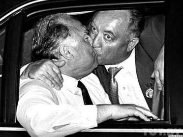

1. [~~Про мой род, себя и нашу элиту~~](./1.md)
2. [~~Бацькаўшчына~~](./2.md)
3. [~~Академия — завод — университет~~](./3.md)
4. [~~МРТИ — хорошо, БГУ — лучше~~](./4.md)
5. [~~Чернобыль~~](./5.md)
6. [~~В Москву, к властям~~](./6.md)
7. [~~Дорога к Вискулям~~](./7.md)
8. [~~Народы малочисленные и к ним приравненные~~](./8.md)
9. [**Если б знал я, с кем еду, с кем водку пью…**](./9.md)
10. [Беловежская пуща, Вискули, 7—8 декабря 1991 года](./10.md)
11. [Беларусь — Соединённые Штаты](./11.md)
12. [Интеллигенция и политика](./12.md)
13. [О университетах и ВУЗах, степенях и лекциях](./13.md)
14. [О «моём» зарубежье](./14.md)
15. [Патология](./15.md)
16. [Через годы, через расстояния](./16.md)

---

# Трогательное послание
Летом 2010 года я получил письмо с предложением быть одним из авторов сборника о создании и деятельности СНГ. Мотивация предложения была весьма убедительной: быть соавтором издания, чьи «*свидетельства могут стать бесценным источником правдивой, объективной информации, будут способствовать разъяснению истинной сущности тех проблем, которые существуют в Содружестве в настоящее время*». Письмо было подписано главой Белорусского торгово-финансового союза (БТФС) Вячеславом Францевичем Кебичем.
Я и мысли не допускал, что предложение довести до людей *правдивую объективную информацию* может исходить от человека, который в 2008 году в своей книжке «Искушение властью» наплакал огромную лужу слёз по поводу кончины КПБ-КПСС, без излишней скромности представил себя политиком, известным всему миру, с которым с советских времён считаются руководители крупнейших стран, обвинил меня во всех смертных грехах, манипулируя клеветой, подготовленной его избирательным штабом в 1994 году.
После беглого пролистывания «Искушения властью» желание читать книгу у меня исчезло, я понял для чего она предназначена. Критиковать автора за желание продемонстрировать преданность нелегитимному правителю Беларуси лишь способствовало бы достижению им поставленной неблаговидной цели, и на вопросы журналистов по этому поводу я отвечал примерно так.
— Хорошо, что Вячеслав Францевич хотя и с опозданием но понял и показал в книге, что его друзьями-соратниками были люди абсолютно недостойные — В. Заметалин, П. Кравченко, И. Антонович и М. Мясникович.
Полученное от Кебича обращение ко мне, как к «*бесценному источнику правдивой объективной информации*», заставило сделать над собой усилие и книгу прочесть. Стало ясно, что настанет время, когда мне не избежать детального пояснения, почему я решительно изменил отношение к человеку, которого уважал и с которым, как мне казалось, мы сделали доброе дело, известное всему миру.
И вот случай настал, не объяснить нельзя.

# Знакомство
Я познакомился с Кебичем в год Чернобыльской катастрофы. Он произвёл хорошее впечатление и как человек, и как зам. председателя Совмина БССР — Председатель Госплана БССР. В отличие от других заместителей тогдашнего премьера Михаила Васильевича Ковалёва у него было мало снобизма, хотя хватало оснований для того, чтобы быть заносчивым. Его послужной список впечатлял: инженер, главный инженер, директор станкостроительного завода, ставшего образцово-показательным в производственном и социальном плане, пять лет партийной работы в горкоме, обкоме и ЦК КПБ. На всех инженерно-менеджерских должностях он преуспел. Лучше иных разобрался, что такое Чернобыль и не предлагал никаких партийных наскоков для уменьшения его пагубных последствий. С 1989 года был Народным депутатом СССР, находил способы не демонстрировать публично в Кремле, во Дворце съездов партийного единства с чисто партийными депутатами от БССР типа Е.Е.Соколова, В.В.Григорьева, В.М.Семёнова, А.А.Малофеева, Н. С. Игрунова, А. И. Дубко, Н. И. Дементея, В. И. Гончарика, В. И. Бурского, В. Л. Бедули.
Через несколько лет понял, что он обладал незаурядным даром быть своим среди партноменклатуры, так и в среде демократично настроенных депутатов, не зашореных догмами КПСС. Я не раз был свидетелем его перевоплощения, но никогда не осуждал его, думая, что иначе для пользы дела поступать нельзя. Не единожды он заглядывал ко мне в кабинет в мою бытность Первым заместителем Председателя ВС. Когда я ему говорил, что подымаемый им вопрос не ко мне, а к Председателю Верховного Совета Н. И. Дементею, он меня останавливал: «я знаю, к кому пришёл». У меня оставался единственный выход — подтвердить, что пришёл он к тому, к кому надо, и, не ссылаясь на Кебича, искать способ решить с Председателем Верховного Совета поднятый премьером вопрос.
В начале сентября 1991 года Н. И. Дементей вынужден был уйти в отставку, так как, хотя и вяло, но вполне определённо солидаризовался с ГКЧП. Встал вопрос о выборе нового Председателя Верховного Совета БССР. Выборы состоялись 9 сентября. Кебич и я были выдвинуты кандидатами на эту должность и вышли во второй тур голосования. За меня проголосовало больше депутатов, чем за Кебича, но менее половины от полного списочного состава депутатов ВС БССР. Должно было состояться повторное голосование. Если бы при повторном голосовании ни Кебич, ни я не набрали требуемого для избрания количества голосов, то мы оба теряли право баллотироваться далее. В создавшейся ситуации я и сам, несмотря на имеющееся у меня преимущество по голосам, подумывал, не снять ли мне свою кандидатуру, чтобы ВС не избрал председателем кого-то совсем неподходящего. Кебича я считал тогда лучшим из всех остальных возможных претендентов на эту должность. Однако Кебич меня опередил, свою кандидатуру снял, фактически, предпочтя меня другим возможным претендентам. Я счёл его поступок благородным, поблагодарил и выразил надежду на плодотворное сотрудничество парламента и правительства, которое он возглавляет. После избрания меня Председателем, очень долго был убеждён в том, что мы добросовестно сотрудничаем, простите за пафос, на благо Беларуси.
Немало депутатов, сотрудников Верховного Совета и Совета Министров, находившихся в доверительных со мной отношениях, предупреждали меня о двойной игре Кебича, о его страстном желании меня «подсидеть », иными словами — скомпрометировать . Их аргументы не казались мне убедительными. Ссылки были, преимущественно, на откровения премьера в нетрезвом виде. Никак на это не реагируя, я сожалел лишь о множестве подхалимов в окружении Вячеслава Францевича, не устающих наливать ему рюмку за рюмкой, что временами приводило к окончанию рабочего дня главы правительства в полдень. Но один разговор мне запомнился.
— Держитесь от Кебича подальше, он сам ещё более-менее, но ближайшие подчинённые такие, что ради завоевания расположения шефа могут раздавить, оклеветать, разжевать и выплюнуть кого угодно. Когда они становятся членами его команды, приносят клятву на верность шефу. Он, в свою очередь, клятвенно обещает защищать их при любых неблагоприятных поворотах судьбы.
Так счёл своим долгом сказать мне уходивший на пенсию сотрудник Совмина, с которым я был знаком задолго до того, как оказался в депутатах. Зная, что мафиозный принцип господствовал в Академии наук и ряде вузов, я не замечал сходства Кебича с тамошними «мафиози», и продолжал считать его лучшим из представителей исполнительной власти.
Прозрение наступило позднее. К сожалению, я не раз ошибался в людях. К счастью, сначала всегда думал о тех, в ком ошибся, лучше. И снова же, к счастью, заблуждения не были долговременными. Одно из самых долгих — Кебич, которому я верил и с которым, как мне казалось, мы вместе стали причастны к важнейшему событию конца второго тысячелетия, собрав здесь в Беларуси глав РСФСР, УССР и БССР и подписав в Беловежской пуще Соглашение о создании Содружества Независимых Государств.
Будь Кебич таким, каким он мне казался, с ним вместе можно было бы сделать очень многое для Беларуси. Я отождествлял его скак лучшими обитателями моей родной Слепянской улицы, видел схожесть их с теми, откуда он родом, так как не раз убеждался, что вокруг Воложина, Ивенца, Першая, Ракова, Налибок живут такие же люди, как на моей родной Комаровке — уважающие друг друга добросовестные трудяги. Но, приписывая добросовестность всем, я ошибся.

# Ансамбль лжецов
Логично предположить, что книги пишут авторы, чье имена напечатаны на обложке. Согласно такому подходу книгу «Искушение властью» написал Вячеслав Францевич Кебич. Нередко люди, занимающее высокое положение в обществе, нанимают для написания своих книг литераторов, записывают желаемое на диктофон, получают от нанятого распечатку, доводят её до приемлемого для себя вида.
У меня есть знакомые, которые писали для кого-то книги, т. е. выполняли литературный заказ. Знаю также и тех, для которых писали книги. Я не отвергаю такой метод написания, хотя все без исключения мои личные попытки воспользоваться помощью профессионала провалились, и ни в одной моей публикации нет ни одной строчки, написанной для меня кем-то. Как бы то ни было, при любом способе создания публикации за написанное несёт ответственность автор, т. е. тот, чьё имя на обложке, в титрах или рядом с заголовком публикации.
Сначала я не мог понять, во-первых, почему в книге грубейшим образом извращена информация о событиях, непосредственным участником которых был сам Вячеслав Францевич? Во-вторых, откуда взялись нелепые многострочные повторения с различным толкованием их сущности? В-третьих, откуда в книге столь опытного бюрократа имеется гора технических противоречий (сравните, например, стр. 313 и 316) и неточностей, включая приписываемые мне участия в мероприятиях и выступления в местах, от которых я был за тысячу километров?
Всё становится на своё место, если предположить, что книгу «Искушение властью» писал для Кебича не один человек и что официаль ный автор не начитывал всё на диктофон, просто формулировал пишущим задания на кого искать только компромат, на кого только позитив, не заботясь о чистоте источников информации и о её правдивости.
И, наконец, самое главное. Не может человек, который обвинил меня в своей книге в публичной наглой лжи, в отречении от отца и прочих смертных грехах обращаться ко мне с официальным письмом как к человеку, чьи «*свидетельства могут стать бесценным источником правдивой, объективной информации, будут способствовать разъяснению истинной сущности тех проблем, которые существуют… в настоящее время*». Значит Кебич либо подписал письмо, не читая, но это маловероятно — письмо короткое, всего десяток строк, либо не читал внимательно книги, автором которой он числится.
Ну зачем, казалось бы, непосредственному участнику писать в книжке неправду о том, что было в Беловежской пуще 7—8 декабря 1991 года? Не привирать, украшая повествование шутками-прибаутками и забавными хитросплетениями, не являть интеллектуала, как это делается в книге, сравнивая запрет КПБ-КПСС с деянием Герострата, а лгать.
Понятно, когда умеренно, а иногда и не совсем, лгут выдумщики, заботящиеся о сенсационности публикаций в своей родной жёлтой прессе. Иное дело — бывший первый премьер-министр независимой Беларуси. Гордо заявить в своём трактате: я оправдываю ложь только во спасение (стр. 216), и здесь же пояснить, когда оправдана ложь жене, ребёнку, больному, при «соображении на троих», т. е. присвоить себе право быть высшим судьёй и право решать, когда можно врать.
Лгать ради спасения жизни — понять можно. И я привожу в этой книге примеры сознательной лжи достойнейших людей, оказавшихся в силу чудовищности государственной машины, которая нас перемалывала, в условиях выбора «ложь или смерть ближних». Но ложь ради сохранения места у кормушки, ради долж ности, приносящей приличный доход, или незаконно присвоенного имущества — преступление такое же, как грабить или воровать. Лгать, чтобы явить преданность, хотя и презираемому, хотя и нелегитимному предводителю, ради личной выгоды, тоже плохо. Однако врать для личного благополучия, *безосновательно пороча тех, с кем вроде бы и дела неплохие удалось сделать* — несовместимо со статусом приличного человека.
Борзописцам, нанятым Кебичем, удалось доходчиво угодить нашему нелегитимному предводителю на посту президента. Тот ещё раз убедился, что правильно осчастливил числящегося в авторах Вячеслава Францевича, назначив его палаточным депутатом и одарив высокой пенсией. Та мудрость, которая без лишней скромности приписывается в книжке числящемуся автором, не украшает сдержанного на самовосхваление человека, потому что мудрость эта не подтверждается разумными поступками «автора», а достигается попытками унизить и оскорбить других.
Тем не менее, в книге убедительно показано, что руководители избирательного штаба кандидата в президенты на выборах 1994 года Вячеслава Кебича — Пётр Кравченко, Михаил Мясникович, Иван Антонович и Владимир Заметалин — полностью лишены таких человеческих достоинств, как честь и совесть. Наш «всенародно избранный» результатами кебичевского обследования должен быть удовлетворён и может совершенно спокойно брать любого из представителей четвёрки в свою команду — в высшем эшелоне нужны именно такие. Назначай на любую должность — не ошибёшься: будет действовать не по закону, а по указанию. Так со всеми четырьмя и произошло.
Следует признать — все эти «звёзды», кроме Заметалина, люди талантливые, образованные и умеющие хорошо работать. Они готовы на всё, но… ради достижения личных целей, ради личной выгоды. А что касается Заметалина, то личной корысти ради он, при наличии «крыши», и на криминал ходил! Замечу ещё раз, характеристики субъектов четвёрки — не мои, это представленные в сжатом виде умозаключения самого Вячеслава Францевича из его книги «Искушение властью».
Возникает законный вопрос, почему же, Вячеслав Францевич, вся эта по характеристикам и определениям, данным в вашей книге — нечисть — возглавила ваш избирательный штаб, и вы это приветствовали? Почему, наконец, и до выборов вы опирались на этих людей и видели в них своих соратников и сподвижников? Ведь вы располагали широчайшими возможностями, и у вас был выбор.
Не пояснили ведь, что именно такие деятели и нужны были вам. И, снова же, вы хорошо и давно знали, что они именно такие: отпетые мошенники, провокаторы, лжецы, позёры без чести и остатков совести. В глаза, правда, никому из них смотреть нельзя, ведь не скрыть, что лживые. Но зачем такая сентиментальность — в глаза смотреть?
А задания какие вы им дали! Армейскому политработнику Заметалину, специалисту по клеветнической пропаганде с целью дезориентации военнослужащих противника — статью написать по-ленински изобличающую, но обязательно с пятью процентами правды и убийственной тщательно придуманной ложью, да такой, которая бы обнулила шансы конкурента.
Заметалин вам в ответ.
— Компромат то я придумаю и в печать протолкну под видом перевода из зарубежной газеты так, что комар носа не подточит.
Никто подлей меня этого сделать не сможет, занимаюсь . Но статей писать не умею. Для сотрудников нужен, какой у меня раньше был.
— Никаких сотрудников, не то время.
профессионал, мастер убийственно яркого подлого слова нужен. Да чтобы искренней правдой казалось и за сердце брало!
— Знаю такого, но сдерёт страшно много!
— Ничего, раскошелимся, если действительно мастер. А зовут-то его как?
— Сашкой зовут, Прохановым.
— Российский писатель-коммунист Александр Проханов?
— Да!
— Этот сдерёт!
И поручили заказать Проханову, и заказали, и заплатили, и напечатали в «Советской Б.», и перепечатать приказали во всех газетах более мелкой значимости. А получился пшик. Пшик, так как примитивный солдафон ваш Заметалин, хотя и полковник запаса, но «поселкового уровня» провокатор, не дорос до махинаций республиканского масштаба, а на интернациональную замахнулся.
После этого вы расплакались в книге, что не знаете, кому он — Заметалин — нанёс больший вред — мне — Станиславу Шушкевичу, как задумывалось, или вам — Вячеславу Кебичу, как по недомыслию получилось. Не будьте лицемерно плачущим большевиком. Статья-утка не причинила вам вреда, тем более, на электоральном поле. Она вам помогла, но окончательно разоблачила вас в глазах тех, для кого вы долго удачно прикидывались высокоморальным человеком.
Министр иностранных дел Пётр Кравченко получил от Вас иное задание.
— Езжай, Петя, в США, — сказали вы ему — проникни на все самые высокие уровни Госдепартамента, скажи, что случайно оказавшийся на высшей государственной должности Шушкевич категорически отказывается ехать в Штаты с визитом и вообще не понимает, что такое государственная служба, а тем более, — официальный визит. Поэтому пусть пригласят меня — премьера, в руках которого вся реальная власть.
Поехал, проник, сказал, как велели. Но поставленной задачи не решил. Вас не пригласили даже просто так, не то что с официальным визитом. И не потому, что Пётр Кузьмич не старался, а потому что это для вас он был профессионалом-министром, а клерки Госдепартамента на мелких вралях-непрофессионалах зубы съели и воспринимали его не иначе как самобытного функционера коммунистического розлива, убеждённого в своей респектабельности, но не разбирающегося даже в азах дипломатического протокола.
Для реализации желаемой Вами задумки нужно было начинать с Полномочного и Чрезвычайного посла Соединённых Штатов Америки в Республике Беларусь Дэвида Суорца. Но вы оставались по-советски мудрым хозяйственником, не политиком. Были убеждены, что если договориться с верхами, то низы подчинятся. Посол был для вас персоной малой значимости. Вы даже имя его перепутали в своей книжке, назвали Майклом. А он Дэвид, Дэвид Суорц — первый посол Соединённых Штатов Америки в независимой Республике Беларусь.
В непристойном окружении окончатель но теряются остатки собственной пристойности. Вы стали врать. Не ошибаться, такое с каждым случается, а врать. И не во спасение жизни или чего-то достойного, как в книжке пишете, а во имя собственной выгоды и собственного благополучия.
Бледнеют перед вами те фантазёры-журналисты, которые были далеко от места, где создавалось и подписывалось Беловежское соглашение. Они с уверенностью очевидцев твердили, что никого в компании подписантов трезвого не было, что все были мертвецки пьяны. Их понять можно, они работали на своих, падких на сенсации, издателей. Вы же сначала не допускали никаких неточностей, освещая произошедшее в Вискулях. Потом заметили, что правда лично вам не на пользу. Во-первых, здешний предводитель все свои неудачи и нелепости начал оправдывать развалом Союза. Во-вторых, и Ельцин, начиная с 1996 года, под давлением усилившихся российских почитателей империи стал публично делать вид, что сожалеет о распаде Союза, а значит и о Вискулях. Не уловили вы, что это был тактический предвыборный ход Ель цина. Ваш друг Черномырдин, воссевший в кресло премьера (в значительной мере, благодаря Вискулям) тоже всплакнул по поводу распада…
А вы перестроились и завели новую песню почти как Высоцкий о Черчилле: это всё придумал Шушкевич в 1991 году. Вам выгодно было так петь, и вы запели и продолжаете петь с упоением.

# Выбор лодки
Внутренний фактор был определяющим. Вы стали во всём, в чём только было можно, угож дать диктатору, которого и человеком приличным никогда не считали. Но ситуация «стабилизировалась» под него. Жестоко, подло, даже кроваво, но под него. И вы под эту ситуацию подстроились. Всё, связанное с дебатами до Беловежской пущи и в самих Вискулях, процедуру подписания Соглашения и оповещения об этом извратили настолько, что опровергать вас, означает впасть в полный маразм. Я делать этого не намерен, просто довожу до читателя правду здесь в этой книге. Благо живых свидетелей всех этих событий достаточно. При сомнениях, есть у кого уточнить. Кстати, всех нас, здравствующих подписантов Соглашения о создании СНГ, собрала в середине февраля 2011 года в Киеве на приёме, организованном российским посольством в Украине, вдова Бориса Николаевича Ельцина Наина Иосифовна. Почему она Вас не пригласила — не знаю. Может книжку Вашу пролистала или рассказали ей, что за небылицы в этой книжке наворочены?
Так вот на этом приёме Леонид Макарович Кравчук, Геннадий Эдуардович Бурбулис, Витольд Павлович Фокин и, естественно, я совсем иное, чем Вы, о Вискулях рассказывали и друг другу ничуть не противоречили. Таким «бесценным источником» можете быть и вы, Вячеслав Францевич, если, простите за повторение грубости, перестанете целеустремлённо угоднически врать.
Приблизьтесь к тому благородству, каким вы наделили себя в книжке! Ведь в моём понимании вы по-прежнему талантливый трудолюбивый человек, как говорят, сам себя сделавший. Вы шли от сохи, от производства к партийной работе, но не задержались на ней. Вернулись к хозяйственной, и на вас взвалили сначала Госплан, а потом и Совмин. Тянуть такие институты тяжко, и чистые партийцы, т. е. работники идеологического фронта, никогда на такое не пойдут. По их терминологии — до такого не опустятся. А вы впряглись и тянули. Тянули неплохо на всех тех должностях, которые ведут порядочного совестливого человека к ранним инфарктам и инсультам.
Из таких, как вы, получаются лидеры национального масштаба, если они вместе с соратниками из людей порядочных и честных вооружают нацию добротной идеей и ведут её за собой. Вы же стремились стать лидером нации весьма изворотливым образом. С одной стороны, опираясь на коммунистическую идею. Вместе с тем, вы хотели стереть в порошок всех остальных, кто ею же руководствуется, а заодно и тех, кто стремится увлечь массы иной идеей. Для этого вы и собрали в своём штабе тех, у кого нет ничего святого, кто готов действовать по вашему указанию, а не руководствуясь какой-то идеологией.
Я бы мог долго повествовать о том, что искренне уважал вас не только из-за происхождения, но и как матёрого советского хозяйственника, сделавшего в советских условиях из ординарного станкостроительного завода имени Кирова «куколку». Правда, и вы не устояли после этого перед соблазном стать партийным боссом. Вы — абсолютно не стойкий, вы срываетесь . Часто совсем непозволительным для мужественного человека образом.
С первого знакомства, понимая, кем является Пётр Кравченко, вы решили, что именно такой человек вам нужен для личного продвижения или, как сейчас говорят для собственных промоций. Избавиться от него, решили вы, не составит большого труда при тех властных полномочиях, которыми реально располагали. Он же с истинным рвением выполнял только те ваши поручения, которые ему лично нравились и ему лично были выгодны. Когда я попросил своего секретаря выдворить его из моего кабинета за наглость, облечённую в форму заманчивого для меня предложения, он успел выкрикнуть, что сотрёт меня в порошок, опираясь на тот факт, что вы — премьер-министр — меня также люто ненавидите, как и он. Иными словами, он в эмоциональном порыве не просто выдал вас, а предал.
У вас не получилось, и не могло получить ся, Вячеслав Францевич, стоять двумя ногами в двух разных лодках. В итоге вы предпочли старую, обжитую, хорошо вам известную лодку партийной номенклатуры, перекрашенную после запрета КПСС -КПБ в лукашенковский цвет. Абсо лютная власть в ней принадлежит кормчему. Вы шли на всё, чтобы стать таким кормчим в итоге избирательной кампании 1994 года. Согласились применять любые средства для достижения желаемого. Именно вы предприняли и превентивные меры задолго до избирательной кампании, хорошо понимая, что без них я буду на выборах достаточно серьёзным вашим конкурентом.
Методы, которыми действовали вы, мне всегда были чужды, поэтому ваши превентивные шаги дали вам некоторое преимущество. Но нашёлся тот, для кого даже такие приёмы — цветочки, а ягодки — провокации типа самопокушений, исчезновения людей, расстрела воздухоплавателей и им подобные — стандартные методы получения желаемого результата. Ему вы проиграли лишь потому, что его бесчестие превосходит ваше.

# Сага о гвоздях
Начало было таким: вы, Вячеслав Францевич, изъявили крайнее изумление, узнав, что по выходным дням я продолжаю собственными руками строить что-то, отдалённо напоминающее дачу на одной из 190 делянок, выделенных в 1986 году садово-огородническому кооперативу университета в 55 километрах от Минска. Моим коллегам по университету и мне не удалось в то время преодолеть стойкое противостояние горячо любимого вами злейшего врага капитализма Анатолия Малофеева, возглавлявшего тогда Минскую область, и получить участки площадью 8 соток, как это было до него. Все мы получили по четыре с половиной сотки. Как было принято в обществе развитого социализма, за счёт сужения проездов и сдвига общих границ довели мы свои делянки до пяти с половиной соток на семью. И я действительно строил домик, обходя запреты того же Малофеева и иже с ним, не площадью 24 квадратных метра, а 36 кв. м, выдавая лишние 12 метров за будущую открытую веранду. Также поступали и все остальные.
Загородные строения «университетчиков», авиаторов, заводчан и прочего советского люда никак не напоминали дачи обкомовцев, горкомовцев, высших партийных и правительственных чиновников. В книге вы предлагаете побывать у этих скромников, включая Анатолия Малофеева, дома и убедиться в их свехскромности и скудной обеспеченности. Не лукавьте, бывал я у многих дома, включая вас, и признаков аскетичности не заметил. Когда же Малофеев приехал ко мне на «дачу», с обкомовской «заимки» возле Негорелого, то долго не мог понять, почему мы не идём в дом, не допуская и мысли, что строение, в котором мы находились — электрифицированный сарайчик, вплотную примыкающий к лесу, — и есть мой дом. Проводя в жизнь линию партии по декапитализации садово -огородных кооперативов, он представления не имел, против чего выступает. А боролся с минимальным уютом, который хотели своими усилиями создать в своих домиках кооперативщики. Стыдно вспомнить, как он направлял комиссии, которые запрещали в дачных сарайчиках «возводить печки» — чтобы согреться в ненастье и высушить одежду. Но даже строения, похожие на увеличенные раз в десять традиционные деревенские собачьи будки, обкомовские, райкомовские и прочие комиссии обязывали укладывать в прокрустово ложе сформулированных Малофеевым и горячо любимой им и вами партией норм и правил. Превышение площади 24 кв. м. и предельно допустимой высоты «конька» в 5,5 м, угрожало нарушителям карами, вплоть до лишения партбилета. Но «капитализм», молча узаконенный для партийно-правительственных активистов, прорастал и на неэлитных садово-огородных участках вопреки желаниям Малофеева и ему подобных.
Вы, именно вы, Вячеслав Францевич, посоветовали мне уменьшить затраты моего драгоценного, как вы изволили заметить, времени на воскресные и праздничные упражнения с топором и бетономешалкой. Предложили воспользоваться правом заказать кое-какие работы в СКБ «с опытным производством» при возглавляемом вами Совмине. Это, мол, делают все руководящие и некоторые другие сотрудники, причём всё сугубо законно, официально, по утверждённому прейскуранту и т. д. и т. п.
Я соблазнился и действительно сделал заказ. По нему для меня действительно были выполнены кое -какие работы. В частности, сложена кирпичная печка, запрет на которую к тому времени все забыли, так как исчезла КПБ, его навязывавшая. Печку вскоре пришлось разобрать, так как она дымила и не грела. Другое дело — был очень качественно оштукатурен и покрашен построенный моими руками домик. И сегодня, приезжая на «дачу», всегда добрым словом вспоминаю штукатура Лёню. Он мастерски устранил и скрыл все сделанные моими руками аглопоритобетонные огрехи.
Выполненные по заказу работы были полностью оплачены наличными по выставленным счетам без всякого промедления.
У меня и в мыслях не было, что вы, Вячеслав Францевич, смотрите далеко в будущее и ищете человека, который смог бы представить сделанные для меня работы как использование моего служебного положения в корыстных личных целях. Вынуждает, видите ли, Шушкевич исполнителей оценить эти работы ниже реальной стоимости. Наживается за государственный счёт... Ведь для этого нужно было найти либо абсолютного невежду, либо стопроцентного негодяя. И вы нашли человека, в котором эти качества на редкость удачно сочетались, точнее — вычислили его, опираясь на свой многолетний опыт контактов с людьми подобного рода.
— Дорогой Александр Григорьевич, — сказали вы руководителю коррупционной комиссии Лукашенко, кстати, в присутствии нескольких депутатов, — советую вам внимательно посмотреть все документы о финансовых расчётах за выполнение заказов в СКБ при Совмине депутатов и руководителей Верховного Совета. Вы обязательно найдёте там, что ищете.
И он нашёл сногсшибательный и так милый вашему сердцу компромат! На заказы Шушкевича списано восемь килограммов гвоздей, хотя в совхозе, которым правил Лукашенко, на это ушло бы не более пяти. Это же пример сногсшибательной коррупции!
— Спасибо, уважаемый Александр Григорьевич, вы очень нам помогли, — воскликнули вы, пожимая руку председателю коррупционной комиссии после выступления и, снова же, в присутствии многих депутатов. Простой люд, полагали вы, т. е. бедный избиратель, отвернётся после такого разоблачения от жирующего за государственный счёт Шушкевича и проголосует за Кебича.

# Утка для «интеллектуалов»
Для более-менее просвещённого по вашему, Вячеслав Францевич, мнению электората и интеллигенции нужна была иная провокация, и вы пригласили, как профессионала-клеветника Владимира вознаградили большевистского трибуна Александра Проханова за его снова же, по Вашему мнению, разгромную статью в мой адрес от имени несуществующего журналиста в несуществующей голландской газете... Вы не только не воспрепятствовали преступной авантюре Заметалина вручить эту статью под видом специального послания ИТАР-ТАСС редактору «Советской Белоруссии» Игорю Осинскому для срочного напечатания, но наоборот, поощрили товарища Заметалина за находчивость. А после всего этого всплакнули в своей книге, что были настолько честным и правдивым, что даже не мобилизовали административный ресурс и поэтому не выиграли президентские выборы 1994 года.
Вы, кое-кем ещё уважаемый и сейчас, Вячеслав Францевич, хотели, чтобы все эти мясниковичи-кравченки-антоновичи-заметалины и им подобные явили достоинство и благородство, вас поддерживая.
Святая наивность!
Административный ресурс ради победы на выборах вы не мобилизовали не потому, что считали это бесчестьем, как следует из вашей книги, а потому что вся ваша команда, более правильно — шайка братанов, которую вы публично изобличили при помощи талантливых литераторов только в 2007 году в своей книге, этим не занималась. Её члены обворовывали вас морально и материально, а при вашем попустительстве и государство, но не ради вашей победы на выборах, а ради своей ненасытной корысти. Они по секрету всему свету представляли вас серьёзно злоупотребляющим алкоголем, и совершенно напрасно в вашем «Искушении властью» вы утверждаете, что не пили с горя. Пили! И спасало вас только то, что вы не подвержены алкогольной зависимости, чего бы так хотели ваши «доброжелатели», чтобы, в конце концов, порвать отношения с вами под благовидным предлогом — как с неадекватным, а по-простому — окончательно спившимся человеком.
И не кажется ли вам, Вячеслав Францевич, что вы окончательно уподобились тем, кого так красочно осудили и разоблачили. Ведь надо же! Целая глава книги с ненавязчивым названием «мне понятна твоя вековая печаль, Беловежская пуща», а материал в ней — слепок подхода к вашему желанию получить пропуск в администрацию президента (стр. 30 вашей книги) всё от того же Мясниковича. Пропуск он пообещал, а сотрудникам приказал — чтобы и ноги Кебича там не было!
Вот и вы поплакались перед диктофоном и попросили Осинского Игоря Николаевича, одного из сочинителей вашей книги, наполнить трагизмом и переживаниями вашу причастность к Соглашению о создании СНГ. Он как талантливый литератор, взял и наполнил: привлёк греческую и древнеримскую мифологию, обыграл промашку Ельцина в Верховном Совете Беларуси, патриотические фрагменты белорусской истории, но даты и действующих лиц оставил в том виде, в каком Вы ему сообщили.
А память у вас, оказывается, сбоит. В лучшем для вашего здоровья случае это не сбои, а тщательно продуманная небрежность, способ привлечь внимание. Но, если это так, зачем называть посла США Майклом, когда он был и остаётся Дэвидом Суорцем? Зачем писать, что 25 ноября 1991 года у Горбачёва в Ново-Огарёво собрались главы семи республик, в том числе руководители России, Беларуси, Украины и Казахстана? Более чем за месяц до этого, 20 октября 1991 года в том самом Ново-Огарёво руководители, в том числе и я, без громогласных заявлений условились не встречаться с Горбачёвым без крайней надобности. Если кто-нибудь и нарушил эту договорённость, то только не я. Вы же приписываете мне сакраментальные заявления на встрече, которой не было и не могло быть.
Игорь Николаевич Осинский, числящийся в титрах вашей книги редактором, добросовестно писал её вам. Нашёл в Интернете (или в библиотеке) публикации о том, как готовилась встреча в Ново-Огарёво 25 ноября 1991 года, кто на неё приглашён…, но не мог найти и поэтому не нашёл информации о том, что главы республик тайно условились на неё не ехать. Большинство из них, в том числе и я, поступили в соответствии с договорённостью. Об этом вы, Вячеслав Францевич знали, и такой подход приветствовали.
Не я, как написано в книге, поддержал Ельцина 25 ноября в Ново-Огарёво, меня там в этот день просто не было. Уж если быть точным, Ельцин поддержал меня, потому что он выступил вторым на Госсовете 20 октября 1991-го (а не 25 ноября, как написано в книжке). Именно там, в Ново-Огарёво 20 октября я, наконец, смог выполнить вашу слёзную просьбу — пригласить Президента России в Беловежскую пущу на охоту, чтобы вместе с вами уговорить его помочь Беларуси с нефтью и газом в предстоящую нелёгкую зиму.
И с Кравчуком ваши писаки напутали: именно Вы попросили пригласить Леонида Макаровича в пущу, ведь у нас с Украиной общая проблема, говорили вы, — топливо на зиму, вместе с Украиной лучше отстаивать общие интересы. Более того, не встречался я с Кравчуком после 8 декабря 1991 года ни в Вискулях, ни в пуще, как написано в вашей книге. Сорвалась встреча. Ельцин не смог приехать, да и я прилетел в Минск из Франкфурта с неожиданно большим опозданием. Кравчук к этому времени из Вискулей уехал.
Если же совсем откровенно, то я бы очень хотел, чтобы многое выдуманное вашим писательским консилиумом и написанное в «Искушении властью» обо мне было бы правдой. Какая высочайшая оценка эффективности моего политического интриганства, причём даже не на уровне Остапа Бендера, а по меньшей мере на уровне Макиавелли и Ришелье.
Это же надо, как подан Шушкевич в вашей книжке!
Задумал констатировать в официальных документах факт прекращения существования СССР как геополитической реальности и как субъекта международного права. Околпачил величайшего сторонника сохранения Союза зачинщика перестройки — президента СССР Михаила Горбачёва. Пригласил не ожидавших такой наглости президентов России и Украины как бы на охоту. Использовал страстное желание первого стать полноправным хозяином России и желание второго подтвердить верность результатам украинского референдума о независимости. Собрал всех в Беловежской пуще и решил одним махом вопрос о признании независимости Беларуси Россией, которая с 1794 года безо всяких ограничений владела белорусской территорией и топила в крови всех, порывавшихся независимость Беларуси отстоять . Нашёл, так сказать, способ утешить всех белорусских патриотов бескровным завоеванием независимости.
Кроме того, всё предельно легитимно. Все субъекты создания СССР в наличии. Закавказская Федерация исчезла, не оставив наследника. В наличии и полномочные представители тройки, наделённые своими Конституциями правом подписывать международные договора от имени своих государств.
А с ратификацией как схитрил. На вопрос депутатов, как идёт процесс ратификации в России, соврал, что россияне уже ратифицировали, только поэтому и Верховный Совет Беларуси ратифицировал вопреки мнению 200-миллионного народа великой страны...
Полно врать, Вячеслав Францевич, на вопрос я ответил чуть-чуть иначе, а именно так, как сказал мне Бурбулис, которому я позвонил: все комитеты российского парламента, представившие заключения спикеру, рекомендуют ратифицировать. И к тому же, где было ваше мнение? Чего ради сидели и молчали, как мышь под веником.
А теперь осмотритесь, к чему привело Беловежское соглашение через 20 лет и чего оно позволило избежать сразу же после подписания?
На вторую часть вопроса лучше всего отвечают документы, решение об обнародовании которых получил от риксдага министр иностранных дел Швеции Карл Бильдт. Дипломатические документы, посланные шведскими посольствами в МИД Швеции до декабря 1991 года, полны обеспокоенности об угрозе широкомасштабной гражданской войны на территории Советского Союза.
Мы же с вами, Вячеслав Францевич, составляем одну третью часть тех сил, которые нашли способ и распад СССР констатировать, и войну предотвратить, не позволив событиям развиваться по югославскому варианту. Остальные две трети — это Ельцин, Бурбулис, Кравчук и Фокин, по 1/6 на каждого. Не отдавайте мне свою долю, свою одну шестую. Мне не нужна 1/3, мне своей 1/6 достаточно…
А причина, по которой вы её мне отдаёте, банальная. Вы, к сожалению, заразились ложью от своего насквозь лживого окружения и, мягко говоря. вещаете неправду, чтобы не выглядеть причастным к тому, чем можете гордиться больше, чем от всего иного, сделанного вами за всю жизнь. Спасаете не кого-то, не жизнь человека, а свою долю у кормушки государственной, которой заведует ваш давно переставший быть легитимным правитель . Заигрываете с ним, поддакиваете ему. Его удовольствия ради восхваляете коммунистические порядки и замшелых мракобесов типа Малофеева. Оправдываете примитива, давившего всякое начало человечного подхода и даже мужественным поступок его называете по отстаиванию с пеной у рта на трибуне парламента права на существование партии и идеологии, покрывшей трупами невинных людей пространство от Бреста до Чукотки, изгнавшей целые народы со своих земель и узаконившей колхозное крепостное право в середине 20 века на всей территории Советского Союза.
Ведь так, по вашему мнению, везло Беларуси на коммунистических руководителей, одним из которых были и вы! Такой мудрый Понамаренко, тот самый который давил, душил, репрессировал невинных. Хорошо, что хоть о Цанаве не вспомнили, как о борце с придуманными контрреволюционерами.
Зато воспели почти всех высших коммунистических функционеров, которые о людях заботились! Не обо всех, правда, но о руководящих уж точно заботились, но прежде всего — о себе. А их культурный уровень какой высокий, хотя и чисто коммунистический, но высокий. Как противостояли запрету деятельности КПБ на Верховном Совете. Ну просто интеллектуалы и вместе с тем — секретари ЦК КПБ Михаил Лагир, Николай Дементей, Анатолий Малофеев; на лица посмотрите, речи послушайте — не оторвётесь. Нельзя забыть и Николая Игрунова. Специальную подготовку человек прошёл, чтобы всякого рода национальные проявления в корне душить. А вот Егоров Владимир Демъянович согласно книжке человек очень плохой, с «двойным дном».
Для вас, Вячеслав Францевич, плохой, так как действительно, как и вы — с двойным дном, но вы, скорее, с тройным! Но его и даже вас я за это не упрекаю: не могло быть в советское время ни премьера, ни министра-силовика без двойного дна. Но не любите вы Егорова за то, что он — интеллектуал и нередко имел прекрасно обоснованное весомое собственное мнение, отличное от вашего.
Выгодную позицию ищете и легко находите, хорошо понимая умственный примитивизм правителя. Гордо отвергаете концепцию Беловежского соглашения, под которой поставили свою подпись. Соблюдаете обязательную для советской, гебельсовской и сегодняшней белорусской государственной пропаганды пятипроцентную норму правды и 95% брехни в угоду властвующему правителю.

# С кем вы одной крови?
Замахиваться на память предков, Вячеслав Францевич, не позволяли себе даже ваши собратья по коммунистическому подходу к действительности, по единопартийному разуму. Утверждать, что я — Шушкевич Станислав Станиславович — вынужден был ради своего спасения публично отказаться от своего отца — подлое враньё, на которое оказались способными пойти толь ко вы. Напомню: это аргумент из голландской утки, спроектированной профессионалом-клеветником Заметалиным. Но его фамилии под статьёй нет, а ваша — на обложке книги. По меркам интеллигентного человека вещать такое — поступок кощунственный. Для настоящего советского коммуниста, а вся ваша книга — подтверждение тому, что вы им были и остаётесь — дело обычное.
У меня всегда были и есть причины гордиться своим отцом, а не только сочувствовать его тяжкой доле. Вам, Вячеслав Францевич, проще с основаниями отказаться от отца, который по вашим же словам в книге служил в польской армии не то рядовым, не то лошадью. Моего же и голову склонить перед властным невежеством никто не смог заставить, а вашего... В весёлом состоянии жена капитана велела вашему папе становиться на четвереньки и возить её на себе.
Но я не призываю вас стать Павликом Морозовым, хотя по отношению к своей родине и своему языку вы им давно стали. И стали не ради спасения чьей-то жизни, а из-за неуёмного желания оставаться у кормушки. Желание не покинуло вас и после проигранных президентских выборов. Но приближение к кормушке обязывало льстить новому предводителю с таким усердием, что о совести нужно было забыть. И вы забыли.
Моего отца и пытками не вынудили написать «закладную» на сотрудников, друзей и просто знакомых, за которую обещали освобождение из тюрьмы тогдашнего КГБ. Мои предки никогда не теряли человеческое достоинство. Мне не нужно рыться для этого в архивах, как вы обязали рыться главного архивариуса страны, желая найти что-то, подтверждающее ваше фамильное благородство. Не нашёл архивариус, а если и нашёл, то не то, что вам хотелось получить, поэтому как вежливый человек сказал, что не нашёл.
Перечисляя в книге свои достоинства, вы так увлеклись, что не оставили места для самокритики, как это у настоящих коммунистов принято. Поэтому позволю себе вас дополнить.
Ещё во время вашего премьерства звонит мне незнакомый человек. Вряд ли я наврежу ему, раскрыв через 18 лет суть его поступка.
— Не могли бы вы, Станислав Станиславович, ко мне подъехать?
Подъехал, встретились, познакомились. Не можем, говорит, мы выполнить приказ нашего шефа уничтожить весь не направленный в продажу тираж книжки о вас А. и Л. Класковских «Пуцявіна лёсу». Ему же приказал это сделать сам Вячеслав Францевич Кебич. Так вот мы подготовили акт, что книги пущены под нож из-за того, что их не покупают, а сами книги хотим подарить вам. Они, пожалуй, вам пригодятся и в ваши «Жигули» поместятся.
Так я стал собственником 1500 экземпляров книжечек, которые не один год дарил тем, кто интересовался моей биографией.
Долго я не мог понять, почему вы так искажаете свершившееся в Беловежской пуще. С одной стороны благодарить бы вас надо за то, что мне одному вы приписываете и идею там собраться и идею Союз развалить. Спасибо, но мне и того, что удалось сделать лично мне и принадлежит именно мне, достаточно, чтобы гордиться содеянным всю жизнь. Да и потомкам есть, что для гордости оставить.

Вы же — прагматик, заботящийся, прежде всего, о своём сегодняшнем благополучии. Мягко, но убедительно восхваляете Лукашенко, хорошо зная его сущность, которую когда-то откровенно и правильно поносили. Хвалите всех руководителей-коммунистов, забывая, что из-за них и таких, как они, миллионы людей были репрессированы, уничтожены, расстреляны безо всякой вины. Восхваляете строй, при котором нужно было всю жизнь стоять в очереди на жильё и не иметь надежды на какое-то светлое будущее, в то время как более половины промышленности республики работало не на благо своих граждан, а на неизбежную кровавую войну с капиталистическим окружением.
Опомнитесь, детям и внукам вашим будет за вас стыдно!
Говорят, что вам пишут новую книжку. Не доверяйте такую работу кому-то, как в случае с «Искушением властью», возьмите авторучку, лист бумаги или же садитесь за компьютер и покайтесь, то есть напишите правду и спите спокойно, не мучаясь угрызениями совести. Если же вы уже совсем привыкли к удобной и выгодной лично для вас версии, то почивайте далее, не возвращайтесь к истине. Пригласите членов вашего президентского избирательного штаба, коих справедливо осуждаете в книжке как мошенников, позёров, лжецов и т. п., предложите тост и начните его так.
— Мы с вами, коллеги, одной крови!

---

1. [~~Про мой род, себя и нашу элиту~~](./1.md)
2. [~~Бацькаўшчына~~](./2.md)
3. [~~Академия — завод — университет~~](./3.md)
4. [~~МРТИ — хорошо, БГУ — лучше~~](./4.md)
5. [~~Чернобыль~~](./5.md)
6. [~~В Москву, к властям~~](./6.md)
7. [~~Дорога к Вискулям~~](./7.md)
8. [~~Народы малочисленные и к ним приравненные~~](./8.md)
9. [~~Если б знал я, с кем еду, с кем водку пью…~~](./9.md)
10. [**Беловежская пуща, Вискули, 7—8 декабря 1991 года**](./10.md)
11. [Беларусь — Соединённые Штаты](./11.md)
12. [Интеллигенция и политика](./12.md)
13. [О университетах и ВУЗах, степенях и лекциях](./13.md)
14. [О «моём» зарубежье](./14.md)
15. [Патология](./15.md)
16. [Через годы, через расстояния](./16.md)

