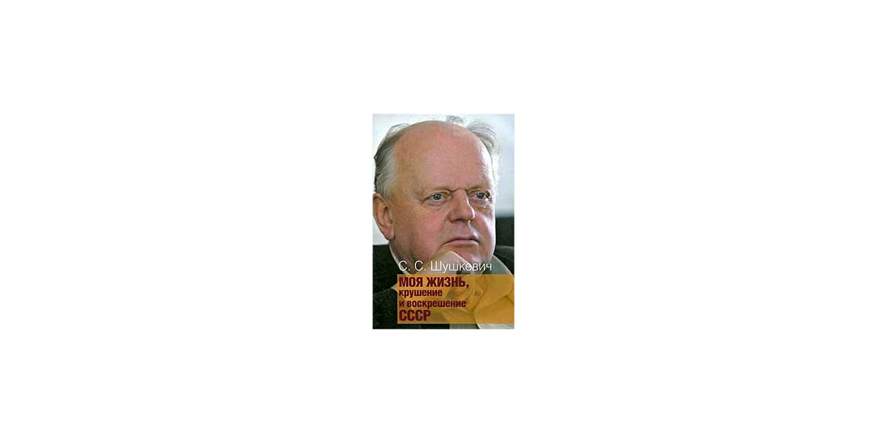

# Моя жизнь. Крушение и воскрешение СССР

Мемуары Станислава Шушкевича — это живая и альтернативная история Советского союза, его развала и… воскрешения.
Здесь — правда о Ли Харве Освальде, Чернобыльской катастрофе, беловежском соглашении о развале СССР, президентах бывших и нынешних, интеллигенции, выборах и отсутствии выбора…

## Станислав Шушкевич

Советский и белорусский партийный, государственный и политический деятель, Председатель Верховного Совета Республики Беларусь (1991—1994), подписавший Беловежские соглашения в 1991 году.

[Википедия](https://ru.wikipedia.org/wiki/%D0%A8%D1%83%D1%88%D0%BA%D0%B5%D0%B2%D0%B8%D1%87,_%D0%A1%D1%82%D0%B0%D0%BD%D0%B8%D1%81%D0%BB%D0%B0%D0%B2_%D0%A1%D1%82%D0%B0%D0%BD%D0%B8%D1%81%D0%BB%D0%B0%D0%B2%D0%BE%D0%B2%D0%B8%D1%87)

---

Тем, кому предназначено судьбой вернуть Беларусь в Европу — белорусской молодёжи — посвящается. Учитесь на наших ошибках, не будьте избыточно доверчивыми.

Я, Шушкевич Станислав Станиславович, выражаю искреннюю благодарность Фонду Ельцина, Slovak Aid (Slovak Agency for International Development Cooperation), Министерству иностранных дел Словакии и Посольству Словакии в Минске, оказавшим мне — пенсионеру, лишённому пенсии декретом президента Республики Беларусь №16 от 9 сентября 1997 года, поддержку, позволившую написать эту книжку.

---

# [Содержание](./toc.md)

1. [**Про мой род, себя и нашу элиту**](./1.md)
2. [Бацькаўшчына](./2.md)
3. [Академия — завод — университет](./3.md)
4. [МРТИ — хорошо, БГУ — лучше](./4.md)
5. [Чернобыль](./5.md)
6. [В Москву, к властям](./6.md)
7. [Дорога к Вискулям](./7.md)
8. [Народы малочисленные и к ним приравненные](./8.md)
9. [Если б знал я, с кем еду, с кем водку пью…](./9.md)
10. [Беловежская пуща, Вискули, 7—8 декабря 1991 года](./10.md)
11. [Беларусь — Соединённые Штаты](./11.md)
12. [Интеллигенция и политика](./12.md)
13. [О университетах и ВУЗах, степенях и лекциях](./13.md)
14. [О «моём» зарубежье](./14.md)
15. [Патология](./15.md)
16. [Через годы, через расстояния](./16.md)
